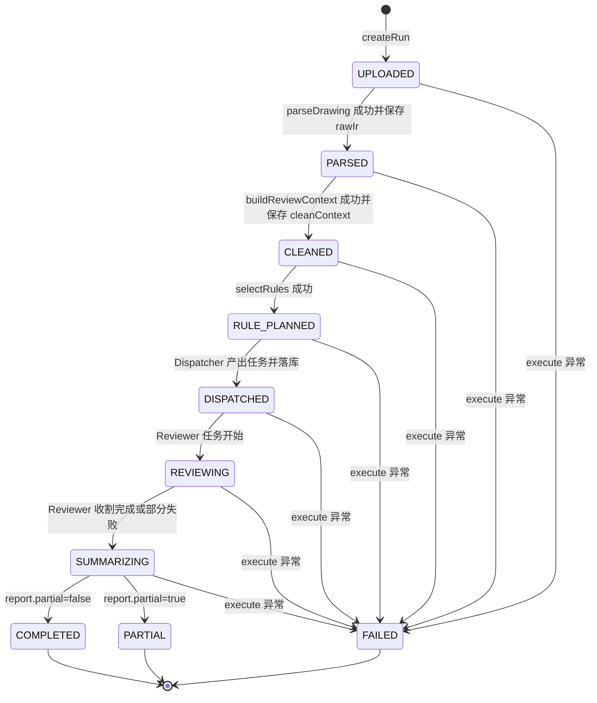
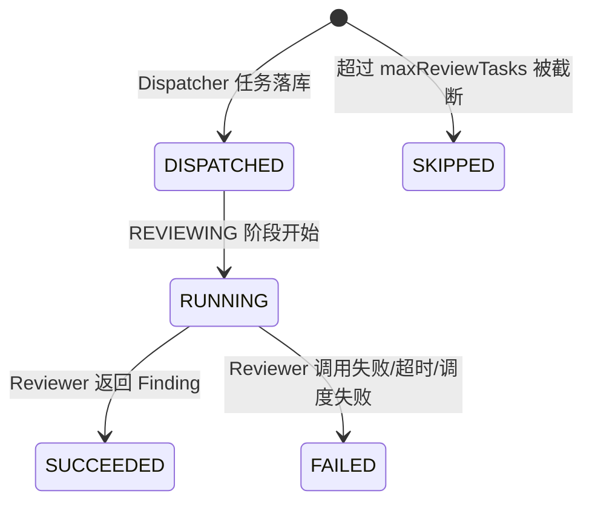
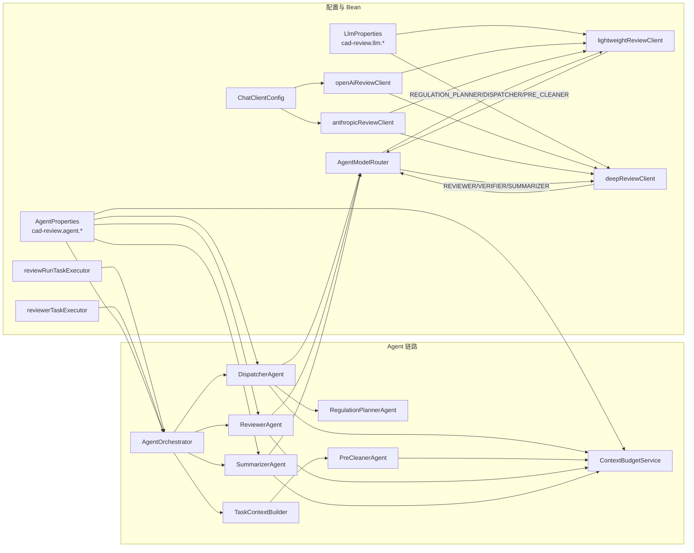

# CAD 多 Agent 审图工作流

本文基于当前代码实现整理，核心入口与链路包括：

- `ReviewRunController`：异步审图 HTTP 入口。
- `ReviewRunService`：创建 `runId`、落库、提交异步执行、推进状态。
- `AgentOrchestrator`：解析、Dispatcher、Reviewer 并发、Summarizer 汇总的编排器。
- `ContextBudgetService`：模型输入上下文预算与裁剪。
- `TaskContextBuilder`：为单个 Reviewer 任务构建最小证据包。
- `AgentModelRouter`：按 Agent 角色选择轻量模型或深度模型。
- `ReviewRunStatus`：异步 run 的主状态枚举。

## 1. 总流程

```mermaid
flowchart TD
    A[客户端上传 CAD 文件<br/>POST /api/cad/review-runs] --> B[ReviewRunController.create]
    B --> C[ReviewRunService.create]
    C --> D[生成 UUID runId]
    D --> E[repository.createRun<br/>status=UPLOADED]
    E --> F[MultipartFileSnapshot<br/>复制上传文件字节]
    F --> G[reviewRunTaskExecutor 异步执行 execute]
    C --> H[立即返回 runId + UPLOADED]

    G --> I[AgentOrchestrator.parseDrawing]
    I --> I1{文件后缀}
    I1 -->|.dwg| I2[CadParserService.parseDwg]
    I1 -->|.dxf| I3[CadParserService.parseDxf]
    I2 --> J[保存 raw_ir_json<br/>status=PARSED]
    I3 --> J

    J --> K[CadIrCleaner.buildReviewContext]
    K --> L[保存 clean_context_json<br/>status=CLEANED]

    L --> M[AgentProperties.selectRules(ruleSet)]
    M --> N[status=RULE_PLANNED]

    N --> O[AgentOrchestrator.dispatchWithTimeout]
    O --> P[IrViewService.buildSummary]
    P --> Q[DispatcherAgent.dispatch]
    Q --> Q1[RegulationPlannerAgent.digest rules]
    Q1 --> Q2[ContextBudgetService.wrap<br/>role=DISPATCHER]
    Q2 --> Q3[AgentModelRouter.clientFor(DISPATCHER)<br/>lightweightReviewClient]
    Q3 --> Q4[StructuredOutputSupport.call]
    Q4 --> Q5[校验并规范化 ReviewTask]

    Q5 --> R[AgentOrchestrator.limitTasks]
    R --> S[可执行任务 upsert DISPATCHED]
    R --> T[超限任务 upsert SKIPPED]
    S --> U[status=DISPATCHED]
    T --> U

    U --> V[status=REVIEWING]
    V --> W[可执行任务 upsert RUNNING]
    W --> X[AgentOrchestrator.reviewTasks 并发执行]

    X --> X1[resolveTaskRules]
    X1 --> X2[TaskContextBuilder.build]
    X2 --> X3[CadIrCleaner.buildReviewContext]
    X3 --> X4[IrViewService.slice<br/>按 entityIds/layerNames 切片]
    X4 --> X5[PreCleanerAgent.cleanForTask]
    X5 --> X6[ContextBudgetService.wrap<br/>role=PRE_CLEANER]
    X6 --> X7[ReviewerAgent.review]
    X7 --> X8[ContextBudgetService.wrap<br/>role=REVIEWER]
    X8 --> X9[AgentModelRouter.clientFor(REVIEWER)<br/>deepReviewClient]
    X9 --> X10[StructuredOutputSupport.call]
    X10 --> X11[校验 Finding<br/>ruleId/areaId/锚点/置信度]

    X11 --> Y[成功任务 upsert SUCCEEDED<br/>失败/超时任务 upsert FAILED]
    Y --> Z[status=SUMMARIZING]
    Z --> AA[AgentOrchestrator.summarize]
    AA --> AB[SummarizerAgent.summarize]
    AB --> AB1[冲突检测]
    AB1 --> AB2{是否启用二次校验且命中条件}
    AB2 -->|是| AB3[ContextBudgetService.wrap<br/>role=VERIFIER]
    AB3 --> AB4[AgentModelRouter.clientFor(VERIFIER)<br/>deepReviewClient]
    AB4 --> AB5[LLM 二次校验 Finding]
    AB2 -->|否| AB6[跳过二次校验]
    AB5 --> AC[计算覆盖率/整体结论/reason]
    AB6 --> AC
    AC --> AD[生成 ReviewReport]
    AD --> AE[repository.saveReport]
    AE --> AF{report.partial?}
    AF -->|false| AG[status=COMPLETED]
    AF -->|true| AH[status=PARTIAL]

    G -->|任意异常| ERR[catch Exception]
    ERR --> ER1[Summarizer 生成降级报告]
    ER1 --> ER2[saveReport]
    ER2 --> ER3[status=FAILED]
```

## 2. 状态机

`ReviewRunStatus` 当前定义如下：`UPLOADED`、`PARSED`、`CLEANED`、`RULE_PLANNED`、`DISPATCHED`、`REVIEWING`、`SUMMARIZING`、`COMPLETED`、`PARTIAL`、`FAILED`。



子任务状态由 `ReviewTaskStatus` 维护：



## 3. Agent、Bean 与模型路由关系



当前实际路由规则：

| 角色 | 调用方 | 模型档位 | 说明 |
| --- | --- | --- | --- |
| `REGULATION_PLANNER` | `DispatcherAgent` 内部摘要规则 | `lightweightReviewClient` | `AgentModelRouter` 支持该角色；当前 `RegulationPlannerAgent.digest` 是本地规则摘要，不直接调模型。 |
| `DISPATCHER` | `DispatcherAgent.dispatch` | `lightweightReviewClient` | 输入 IR 摘要和规则摘要，输出 `ReviewTask` 列表。 |
| `PRE_CLEANER` | `PreCleanerAgent.cleanForTask` | 路由规则为轻量模型 | 当前实现是确定性上下文预算封装，不额外调用 LLM。 |
| `REVIEWER` | `ReviewerAgent.review` | `deepReviewClient` | 单任务正式审图，输出 `Finding` 列表。 |
| `VERIFIER` | `SummarizerAgent.applyVerification` | `deepReviewClient` | 仅在启用二次校验且命中高风险/低置信等条件时调用。 |
| `SUMMARIZER` | 路由规则为深度模型 | `deepReviewClient` | 当前 `SummarizerAgent.summarize` 主要本地聚合、冲突检测、覆盖率和结论决策；未直接使用 `SUMMARIZER` 角色发起汇总 LLM 调用。 |

`ChatClientConfig` 会同时创建业务 Chat 用和 Review Agent 用的客户端。Review Agent 使用 `openAiReviewClient` / `anthropicReviewClient`，不挂载 `skillsTool`，目的是保持结构化 JSON 输出稳定。`lightweightReviewClient` 与 `deepReviewClient` 通过 `LlmProperties.lightweight.provider`、`LlmProperties.deep.provider` 在 OpenAI/Anthropic Review Client 间选择。

## 4. 阶段输入输出

| 阶段 | 入口 | 主要输入 | 主要输出 | 持久化/状态 |
| --- | --- | --- | --- | --- |
| 创建 run | `ReviewRunController.create` -> `ReviewRunService.create` | `MultipartFile file`、可选 `ruleSet` | `ReviewRunCreatedResponse(runId, UPLOADED)` | `cad_review_runs` 插入 `run_id/status/file_name/rule_set` |
| 文件快照 | `ReviewRunService.snapshot` | 上传文件 | `MultipartFileSnapshot` | 不落库；避免异步线程读取失效的上传流 |
| 解析 CAD | `AgentOrchestrator.parseDrawing` | `.dwg` / `.dxf` 文件 | 统一 `JsonNode drawingIr` | `raw_ir_json`，状态 `PARSED` |
| 清洗全图上下文 | `CadIrCleaner.buildReviewContext` | `drawingIr` | `cleanContext` | `clean_context_json`，状态 `CLEANED` |
| 规则选择 | `AgentProperties.selectRules` | `ruleSet` | 启用且命中的 `ReviewRule` 列表 | 状态 `RULE_PLANNED` |
| 任务分派 | `dispatchWithTimeout` -> `DispatcherAgent.dispatch` | `IrViewService.buildSummary(drawingIr)`、规则摘要 | 规范化并排序的 `ReviewTask` 列表 | 可执行任务 `DISPATCHED`，超限任务 `SKIPPED`，run 状态 `DISPATCHED` |
| 任务限流 | `AgentOrchestrator.limitTasks` | Dispatcher 返回任务、`maxReviewTasks` | `DispatchPlan(executableTasks, skippedTasks)` | 超限任务写入 `cad_review_run_tasks`，reason 为任务数量超过上限 |
| Reviewer 任务上下文 | `TaskContextBuilder.build` | `drawingIr`、单个 `ReviewTask`、对应规则 | 经 `PreCleanerAgent` 包装后的任务级上下文 envelope | 当前不单独落库 |
| 并发审图 | `AgentOrchestrator.reviewTasks` -> `ReviewerAgent.review` | 单任务上下文、规则、deadline | `ReviewRunResult(findings, succeededTasks, failedTasks)` | 任务状态从 `RUNNING` 更新到 `SUCCEEDED` 或 `FAILED` |
| 汇总报告 | `AgentOrchestrator.summarize` -> `SummarizerAgent.summarize` | 所有 `Finding`、成功/失败/跳过任务、耗时、跳过规则 | `ReviewReport` | `report_json`，状态 `COMPLETED` 或 `PARTIAL` |
| 异常兜底 | `ReviewRunService.execute catch` | 异常信息 | 降级 `ReviewReport` | `report_json`，状态 `FAILED` |
| 查询状态 | `GET /api/cad/review-runs/{runId}` | `runId` | `ReviewRunSummary` | 从 run 表聚合 task 表计数 |
| 查询报告 | `GET /api/cad/review-runs/{runId}/report` | `runId` | `ReviewReport` | 仅当 `report_json` 非空时返回 |

## 5. 通过 runId 跟踪流程

`runId` 是一次异步审图的主追踪 ID，由 `ReviewRunService.create` 使用 `UUID.randomUUID().toString()` 生成。

### 外部 API 跟踪

1. 创建任务：

```http
POST /api/cad/review-runs
Content-Type: multipart/form-data

file=<dxf/dwg>
ruleSet=<可选，null/空/all 表示全部启用规则>
```

返回：

```json
{
  "runId": "uuid",
  "status": "UPLOADED"
}
```

2. 轮询状态：

```http
GET /api/cad/review-runs/{runId}
```

返回 `ReviewRunSummary`，包含：

- `runId`
- `status`
- `fileName`
- `ruleSet`
- `totalTasks`
- `succeededTasks`
- `failedTasks`
- `skippedTasks`
- `reason`
- `createdAt`
- `updatedAt`
- `completedAt`

3. 获取报告：

```http
GET /api/cad/review-runs/{runId}/report
```

当 `report_json` 尚未生成时返回业务错误：`Review report not found or not completed`。当状态进入 `COMPLETED`、`PARTIAL` 或 `FAILED` 后，通常可以读取到报告。

### 数据库跟踪

`runId` 贯穿三张表：

- `cad_review_runs`：主表，记录 `status`、`file_name`、`rule_set`、`reason`、`raw_ir_json`、`clean_context_json`、`report_json`、创建/更新/完成时间。
- `cad_review_run_tasks`：任务表，以 `(run_id, task_id)` 唯一约束记录每个 `ReviewTask` 的状态、任务 JSON 和失败/跳过原因。
- `cad_review_context_events`：上下文预算事件表，字段包括 `run_id`、`task_id`、`stage`、`budget_json`。

当前代码中 `ReviewRunRepository` 已提供 `saveContextBudget(runId, taskId, stage, budget)` 和建表逻辑，但主执行链路尚未把 `ContextBudgetService.wrap` 产生的预算信息写入该表。因此现在可通过 `runId` 稳定跟踪 run 主状态、任务状态和报告，不一定能查到上下文预算事件。

### 日志跟踪

当前显式日志包括：

- `ReviewRunService.execute` 捕获异常时输出 `Review run {runId} failed: ...`。
- `AgentOrchestrator` 在 Dispatcher/Reviewer 调度失败、Reviewer 任务失败时记录任务级日志。
- `ReviewerAgent` 调用 `StructuredOutputSupport` 时使用操作名 `reviewer-{taskId}`，便于定位单个任务模型调用。

## 6. 当前已完成点

- 已实现异步审图入口：上传后立即返回 `runId`，后台线程执行完整审图。
- 已实现 run 主状态落库和状态轮询。
- 已实现报告查询，报告以 JSON 存在 `cad_review_runs.report_json`。
- 已实现 `.dwg` / `.dxf` 解析分发，并将解析结果转为统一 IR。
- 已实现全图清洗上下文保存：`clean_context_json`。
- 已实现规则选择：支持 `null`、空、`all` 取全部启用规则，也支持逗号/分号/空白分隔的 `ruleSet`。
- 已实现 Dispatcher 任务拆分，并对输出做规则白名单校验、默认值补齐和稳定排序。
- 已实现 `maxReviewTasks` 限流，超限任务标记为 `SKIPPED`，不会进入 Reviewer。
- 已实现 Reviewer 并发执行：使用 `reviewerTaskExecutor`，每个任务按剩余 deadline 动态计算超时。
- 已实现任务级上下文构建：按 `entityIds`、`layerNames` 切片 IR，并按 `evidenceGroups` 选取清洗证据包。
- 已实现上下文预算裁剪：按角色配置最大字符数，多轮裁剪数组和长文本，保留高价值字段，并在仍超限时标记策略。
- 已实现模型路由分层：Dispatcher 等轻量环节走 `lightweightReviewClient`，Reviewer/Verifier 等深度环节走 `deepReviewClient`。
- 已实现 Reviewer 输出校验：`Finding` 必须有结论，`ruleId` 必须属于当前任务，`FAIL` 必须有证据文本和图上锚点。
- 已实现 Summarizer 本地聚合：冲突检测、覆盖率统计、整体结论决策、降级原因生成。
- 已实现异常兜底：任意异常会生成降级报告并将 run 标为 `FAILED`。

## 7. 当前待完善点

- `cad_review_context_events` 表和 `saveContextBudget` 方法已经存在，但当前主链路没有把 `ContextBudget` 按 `runId` 写入，预算可观测性还未闭环。
- `PreCleanerAgent` 当前是确定性预算封装，不额外调用模型；`AgentModelRouter` 虽然为 `PRE_CLEANER` 配了轻量路由，但未实际发起 LLM 清洗。
- `SummarizerAgent.summarize` 当前主要是本地汇总，`SUMMARIZER` 角色的深度模型路由未用于最终报告生成；只有二次校验使用 `VERIFIER` 模型调用。
- `ReviewRunService.execute` 中传给 `summarize` 的 `totalTokens` 为 `null`，报告的 `totalTokens` 成本聚合尚未完成。
- run 状态是单向更新，没有显式状态转移校验；如果后续引入重试/取消/恢复，需要补状态机约束。
- 当前查询接口返回主 summary 和最终 report，但没有独立接口返回任务明细、上下文预算事件或 raw/clean artifact。
- 异步执行依赖本地线程池；服务重启后正在执行的 run 没有恢复/重放机制。
- `ReviewRunController` 当前路径为 `/api/cad/review-runs`，未体现鉴权、租户、用户维度或文件持久化策略。
- `ReviewRunService` 在 Dispatcher 返回空任务时，异步链路仍会进入汇总并生成 `PARTIAL`，但任务表不会有任务记录；前端需要依赖 `reason` 和 `coverage.totalTasks=0` 展示。
- 代码注释存在局部编码显示异常，不影响当前逻辑，但会影响后续维护阅读体验。
